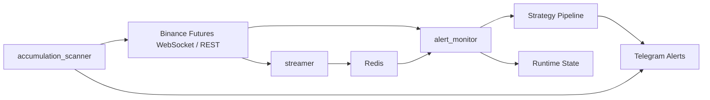

# crypto-monitor

Binance U 本位合约异动监控与 Telegram 告警系统。

当前仓库已经收敛为一个产品：`market_monitor`。  
它的目标是尽早发现合约市场的异常拉升、砸盘、吸筹或风险释放，并通过多因子筛选后推送到 Telegram。

## 当前能力

- 全市场 USDT 永续合约扫描
- `1m / 5m / 15m / 30m / 1h` 多周期异动检测
- WebSocket 实时流 + REST 轮询双通道兜底
- `24h` 涨幅榜优先扫描
- 价格、成交量、OI、订单簿、爆仓、微观结构等因子补充
- 事件级去重，减少同一波行情重复推送
- Redis 冷却、全局限流、Telegram 重试队列
- 每日吸筹池扫描与摘要推送
- Docker 化部署，支持本地开发和云服务器运行

## 架构



## 服务说明

- `redis`
  - 运行时缓存、冷却状态、共享数据
- `streamer`
  - 采集 Binance Futures websocket 数据并写入 Redis
- `alert_monitor`
  - 核心监控服务
  - 负责扫描、因子计算、策略过滤、去重、Telegram 推送
- `accumulation_scanner`
  - 定时运行吸筹池扫描
  - 输出摘要并推送 Telegram

## 目录结构

```text
crypto-monitor/
|- apps/
|  `- market_monitor/
|     |- backend/
|     `- config/
|- packages/
|  `- notifier/
|- utils/
|- docs/
|  `- ARCHITECTURE.md
|- data/
|  |- runtime/
|  `- reports/
|- docker-compose.yml
|- alert_config.py
`- README.md
```

## 关键目录

- `apps/market_monitor/backend`
  - 核心业务代码
- `apps/market_monitor/config/config.json`
  - 运行时策略配置
- `packages/notifier`
  - Telegram 发送组件
- `data/runtime/market_monitor`
  - 运行态数据
  - 例如候选池、冷却状态、重试队列、覆盖率文件
- `data/reports/market_monitor`
  - 回测、校准、研究报告输出

## 环境要求

- Docker
- Docker Compose v2
- Telegram Bot Token
- Telegram Chat ID

## 本地启动

### 1. 准备 `.env`

根目录创建 `.env`，至少包含：

```bash
TELEGRAM_BOT_TOKEN=your_bot_token
TELEGRAM_CHAT_ID=your_chat_id

ALERT_TELEGRAM_ENABLED=true
ALERT_HTTP_PROXY=
ALERT_HTTPS_PROXY=
ALERT_NO_PROXY=localhost,127.0.0.1,redis
```

其他策略参数会从 `.env` 和 `apps/market_monitor/config/config.json` 共同读取。

### 2. 构建镜像

```bash
cd apps/market_monitor/backend
docker build -t crypto-monitor-backend:latest .
```

### 3. 启动服务

```bash
cd ../..
docker compose up -d --no-build
```

### 4. 查看状态

```bash
docker compose ps
docker compose logs -f alert_monitor
docker compose logs -f streamer
docker compose logs -f accumulation_scanner
```

## 云端部署

推荐流程：

1. 本地开发
2. `git add/commit`
3. `git push origin main`
4. 服务器执行拉取和重启

服务器更新命令：

```bash
cd /opt/crypto-monitor
git pull --ff-only origin main

cd /opt/crypto-monitor/apps/market_monitor/backend
docker build -t crypto-monitor-backend:latest .

cd /opt/crypto-monitor
docker compose up -d --no-build
```

## 运行数据说明

以下目录默认不提交到 Git：

- `data/runtime/`
- `data/reports/`

原因：

- `runtime` 是运行时状态
- `reports` 是研究产物
- 这两类数据会持续增长，不适合进入版本库

## 常见排查

### 查看容器

```bash
docker compose ps
```

### 查看监控日志

```bash
docker compose logs --tail=200 alert_monitor
```

### 查看实时流日志

```bash
docker compose logs --tail=200 streamer
```

### 查看吸筹扫描日志

```bash
docker compose logs --tail=200 accumulation_scanner
```

### 检查 Git 代理

如果本地 `git push` 报错连不上 `127.0.0.1:7890`，说明 Git 代理配置残留：

```bash
git config --global --unset http.proxy
git config --global --unset https.proxy
```

## 配置入口

- 代码默认配置：`alert_config.py`
- 服务运行配置：`apps/market_monitor/config/config.json`
- 环境变量覆盖：根目录 `.env`

建议：

- 稳定规则放 `config.json`
- 敏感信息和环境差异放 `.env`

## 备注

- Redis 端口当前只绑定 `127.0.0.1`
- 项目当前没有前端页面，主入口是 Docker 服务和 Telegram 推送
- 当前主分支已经切换到新版 `market_monitor` 架构
